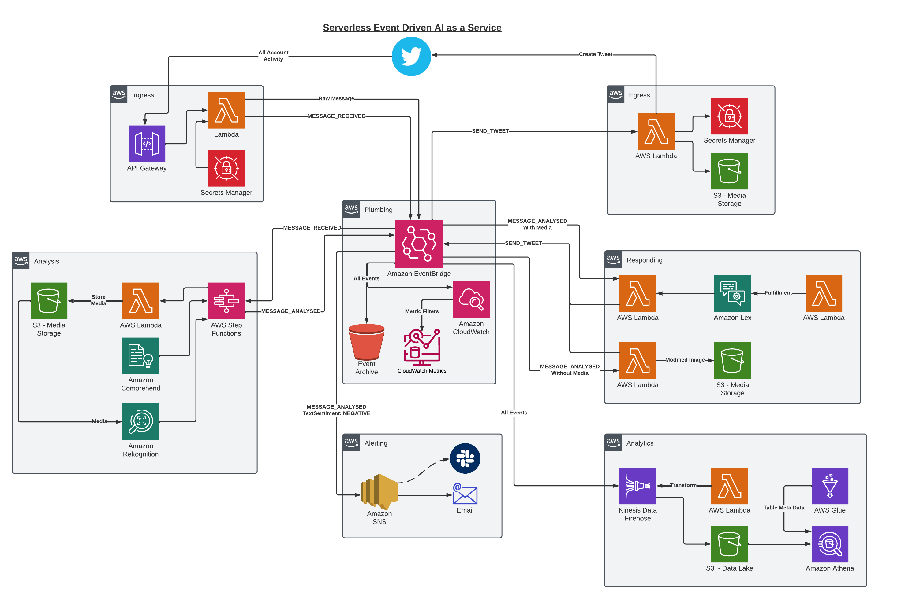

# AWS Serverless Event Driven Twitter Bot
An AWS Cloud Native application using CDK (Written in TypeScript) that defines a Serverless Event Driven application for interacting with Twitter and utilising Machine Learning / AI as a Service.

## Overview


First point to realise for this application, is that it could be simplified down to a few lambdas without Events - and for this single use-case it would work fine. The premise here is to demonstrate many different concepts and a Serverless Event Driven architecture that works for simple applications as well as for the Enterprise.

This whole application is defined here within CDK, apart from the Ad-Hoc Athena queries, some examples can be seen below.

### Serverless

The application only costs money when it is processing a message from Twitter, otherwise it is sitting in a standby state - with the only cost being the minor cost of S3 and CloudWatch log persistence. More can be seen in the Cost section below.

### Event Driven
It is Event Driven because it is reactive based on the webhooks coming from Twitter, as soon as a message is received then AWS will take care of provisioning the resources, as defined in this application, to process it and then shut down again. This works whether it's a single message or a burst of 100's of messages.

## Ingress
The Ingress Microservice at the top of the diagram takes care of accepting the messages from Twitter, this includes the authentication (Using API Keys stored in Secrets Manager). Each message is sent to a Lambda using a Proxy integration - this takes care of Authentication and then sending the payload into EventBridge. *Note, the messages could be sent directly to EventBridge from API Gateway, but a Lambda Authoriser would be needed anyway - so using a Lambda Proxy Integration keeps this simple*.

The raw message is sent to EventBridge with the type of message set as the `detail-type` - Twitter lists all of the types that could be sent to the endpoint in it's [documentation](https://developer.twitter.com/en/docs/twitter-api/enterprise/account-activity-api/guides/account-activity-data-objects).

A simple [Anti-Corruption Layer](https://deviq.com/domain-driven-design/anti-corruption-layer) also publishes a simplified Domain event of `MESSAGE_RECEIVED`.

## Plumbing
The Plumbing Microservice consists of the Event Hub within EventBridge utilised for effectively linking all the Microservices. It also is configured with an Event Archive to allow replaying of events if required.

A catch-all rule exists to push every event into CloudWatch logs for two purposes:
* Debugging
* Metrics

A Metric Filter is deployed to the CloudWatch group for each type of message which generates a customer Metric that can then be used to visualise the events flowing through the system.

## Analysis
The Analysis Microservice deploys a rule into the Plumbing Event Hub to catch all `MESSAGE_RECEIVED` events - this starts an execution on a StepFunction to allow orchestration of multiple services:
* The downloading of any media into a local bucket and then parallel processing of these through different Rekognition endpoints to look for Labels, Text, Faces, etc.
* The parallel processing of text through different Comprehend endpoints to gather insights into the text.
* Pushing the result of all the analysis insights back to the Event Hub with a `MESSAGE_ANALYSED` event.

## Alerting
The Alerting Microservice deploys a rule into the Plumbing Event Hub to catch all `MESSAGE_ANALYSED` events which have found text with a Sentiment of NEGATIVE. This targets an SNS Topic that can be sub-scribed to from Email addresses, Phone Numbers, etc to get alerts when Negative messages are received. It could integrate into Slack and other notification systems.

## Responding
The Responding Microservice deploys two rules into the Plumbing Event Hub to catch all `MESSAGE_ANALYSED` events. One catches those with Images in them, and one catches those with no images, only text.

### Images
The Image rule executes a Lambda which pulls the image from S3 (downloaded earlier) and uses the Rekognition insights to add Celebrity names onto the image next to the faces - and then generates a command Event onto the Plumbing Event Bus with the list of celebrities (or message saying none found) called `SEND_TWEET`.

This can also blur faces of none-celebrities, highlight certain objects, etc.

### Text
The Text rule executes a Lambda which calls Amazon Lex - an AI Conversational Bot which was built/defined in CDK. Lex utilises a separate Lambda to fulfilment any highlighted topics (Jokes/Facts) and returns the response. A `SEND_TWEET` command is generated and pushed to the Plumbing Event Bus.

## Egress
The Egress Microservice deploys a rule into the Plumbing Event Hub to catch all `SEND_TWEET` commands and executes a Lambda which pulls API credentials from Secrets Manager, pulls any images from S3 and then calls the Twitter API to create a reply tweet. *If it wasn't for the Images, then this could be done with a EventBridge API Destination in theory*.

## Analytics
The Analytics Microservice deploys a rule into the Plumbing Event Hub to catch all messages. This targets Kinesis Data Firehose, which is configured to use a Lambda for transformation (simply adds a newline after each message so they can be parsed later) and then store in S3 as a Data Lake - it has a 1 minute buffer configured so is not real-time.

A Glue Table has also been defined for `MESSAGE_ANALYSED` that can be used by Athena - Glue could also be configured to crawl the S3 bucket and build the tables automatically, but for the purposes of the reporting required here a single static table (based on an Internal event that is known) makes most sense.

Athena can be used against the bucket, and using the Glue table to run SQL queries about the messages received and all the analysis data (Such as find all messages that are Positive, or all messages that contained an image with a car in it).

## Utilised AWS Services
* AWS Glue 
* AWS Identity and Access Management (IAM)
* AWS Lambda
* AWS Secrets Manager
* AWS Step Functions
* Amazon API Gateway
* Amazon Athena
* Amazon CloudWatch
* Amazon Comprehend
* Amazon EventBridge
* Amazon Kinesis Data Firehose
* Amazon Lex
* Amazon Rekognition
* Amazon S3
* Amazon Simple Notification Service (SNS)

## Building and Deploying

### CDK Deploy
If not already setup for CDK then you will need:
* [AWS CLI](https://aws.amazon.com/cli/) installed and your workstation [configured](https://docs.aws.amazon.com/cdk/v2/guide/getting_started.html) to the correct account: `aws configure`
* [Node & NPM](https://nodejs.org/en/about/releases/) installed
* CDK installed globally: `npm install -g aws-cdk`
  * This can be verified by running `cdk --version`

Within the root of this application you should be able to then run a `npm install` to restore the dependencies.

Once installed, then you can run `cdk deploy --all --context twitterAccountId=999999` to build and deploy all stacks to your default AWS account/region. **Fill in your own account ID here**. For other CDK commands then check [documention](https://docs.aws.amazon.com/cdk/v2/guide/cli.html).

The API Gateway URL should be output to the console as part of the deployment, but may be hard to find in the output - it will look something like:
`IngressStack.APIGateway = https://99dd9d9dd.execute-api.eu-west-1.amazonaws.com/prod/`

If you cannot find it, then navigate to [API Gateway](https://eu-west-1.console.aws.amazon.com/apigateway/main/apis) in your console and you should have an API called `ingress-api` - if you navigate to this and then Stages and `prod` you can see the url there.

### Twitter Developer Account
The application is reactive to webhooks from Twitter utilising the [Account Activity API](https://developer.twitter.com/en/docs/twitter-api/premium/account-activity-api/overview). For this a Developer Account is needed.

1. Sign up for a [Twitter Developer Account](https://developer.twitter.com/en/apply-for-access)
2. Apply for [Elevated Access](https://developer.twitter.com/en/portal/products/elevated)
3. Create an [Application](https://developer.twitter.com/en/portal/projects-and-apps) and grab all the API Keys/Secrets, Auth Tokens, etc.
4. Follow the `Twitter Secrets` below to add these details to your AWS account.
5. Create a Dev Environment for that application to use the Account Activity API.
6. Register a Webhook with the `https://api.twitter.com/1.1/account_activity/all/{{environment}}/webhooks.json?url={{your_api_gateway_url}}/prod/twitter` API. More details in the[Twitter API Doc](https://developer.twitter.com/en/docs/twitter-api/premium/account-activity-api/api-reference).
7. Register a [subscription for the account](https://developer.twitter.com/en/docs/twitter-api/premium/account-activity-api/api-reference/aaa-premium#post-account-activity-all-env-name-subscriptions). More details in the [Twitter API Doc](https://developer.twitter.com/en/docs/twitter-api/premium/account-activity-api/api-reference).

Once a webhook is registered then an API call will be made to the API Gateway to verify, this can be seen in the logs for the `IngressStack-TwitterActivitylambda` lambda for debugging.

### Twitter Secrets
Create a Secret in Secret Manager manually in the correct AWS account and region with the name `TwitterSecret` and value of the below. (In the UI this is added as a Key/value pair or plaintext of the raw JSON like below):

```
{
  ApiKey: 'TODO',
  ApiSecret: 'TODO',
  AccessToken: 'TODO,
  AccessTokenSecret: 'TODO'
}
```

## Athena
You can use the below ad-hoc queries in Athena by selecting the `messages-data-lake` Glue table created as part of this CDK app. Some sample searches below:

### Select all Celebrities
```
SELECT time, detail.author, celebrityfaces.name
FROM "analysed-messages-table"
CROSS JOIN UNNEST(detail.analysis.images) as t(images)
CROSS JOIN UNNEST(images.analysis.celebrityfaces) as t(celebrityfaces)
WHERE "detail-type" = 'MESSAGE_ANALYSED'
ORDER BY time DESC
```

### Select all Image Labels
```
SELECT time, detail.author, detail.text, labels.name
FROM "analysed-messages-table"
CROSS JOIN UNNEST(detail.analysis.images) as t(images)
CROSS JOIN UNNEST(images.analysis.labels) as t(labels)
WHERE "detail-type" = 'MESSAGE_ANALYSED'
ORDER BY time DESC
```

### Select all Positive Text
```
SELECT time, detail.author, detail.analysis.textsentiment, detail.text
FROM "analysed-messages-table"
CROSS JOIN UNNEST(detail.analysis.images) as t(images)
WHERE "detail-type" = 'MESSAGE_ANALYSED' AND detail.analysis.textsentiment='POSITIVE'
ORDER BY time DESC
```

## Cost
The cost of processing can be broken down into a few areas:
* AI (Rekognition, Lex, Comprehend)
* Code/Infrastructural (StepFunction, Lambda, EventBridge, API Gateway, SNS)
* Storage (S3, Cloudwatch, Secrets Manager)

### AI
This is the most expensive part, especially since the Step Function in this application is currently running the text and images through multiple APIs and not using all the results - obviously in a production ready system that could be handling millions of requests then this should be optimised. As is though, to deal with 1 million requests (50/50 on text and image), it would cost about £1500. This works out as £0.0015 per message - or about 15p for 100 messages.

### Code/Infrastructural
The Code/Infrastructural is the second most expensive part, but mainly because of using a Standard Step Function - which as mentioned above is not optimised as it calls the AI services for everything - adding extra steps, and in production would be better suited to Express step functions for each specific use-case potentially. Even so, this works out at around £130 to handle 1 million messages, this works out as £0.00013 per message, less than 1p for 100 messages.

Interestingly Lambda would be less than a few pounds to handle 1 million messages with the use-case in this application. This works out as a ridiculously small number per message, or even per 100 messages.

EventBridge would be less than £1 top handle 1 million messages. Firehose would be less than £0.30.

### Storage
Storage is cheap on AWS, so to store a lot of history in the Data Lake and in CloudWatch then this would probably work out as up to around £5 (assuming 1 million messages). With more realistic numbers this would be pence.

### Overall
So overall it would be about £1700 to handle 1 million messages with the current design. Or £0.0017 per message - £0.17 for 100 messages.